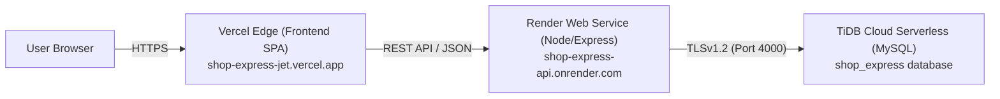

# Shop Express

A production-ready, full-stack e-commerce web platform built with a high-performance **React + Vite** frontend, a scalable **Node.js + Express** REST API, and a serverless **MySQL-compatible TiDB Cloud** database.

Shop Express delivers a modern storefront experience featuring JWT authentication, catalog discovery with real-time keyword search, deep-linked filtering and sorting, persistent shopping carts, address management, transaction-safe checkout with inventory deduction, customer wishlists, verified product reviews, and a complete role-protected administrative dashboard.

---

## 🌐 Live Deployment Links

| Resource | Public Live URL | Description |
|---|---|---|
| **Live Storefront (Frontend)** | [https://shop-express-jet.vercel.app](https://shop-express-jet.vercel.app) | Production customer storefront hosted on Vercel Edge |
| **Backend REST API** | [https://shop-express-api.onrender.com](https://shop-express-api.onrender.com) | Express REST API server hosted on Render Web Service |
| **API Health Status** | [https://shop-express-api.onrender.com/api/health](https://shop-express-api.onrender.com/api/health) | Live server availability health-check endpoint |
| **Database Connection Health** | [https://shop-express-api.onrender.com/api/health/db](https://shop-express-api.onrender.com/api/health/db) | Live TiDB Cloud MySQL connection pool verification |
| **GitHub Repository** | [https://github.com/Lahari-333/e-commerce](https://github.com/Lahari-333/e-commerce) | Official source code repository on GitHub |

---

## Table of Contents
1. [Technology Stack](#technology-stack)
2. [Key Features](#key-features)
3. [Project Architecture & Structure](#project-architecture--structure)
4. [Demo Accounts](#demo-accounts)
5. [Local Development Setup](#local-development-setup)
6. [Production Deployment Architecture](#production-deployment-architecture)
7. [Environment Variables](#environment-variables)
8. [REST API Reference](#rest-api-reference)
9. [Automated Testing & Quality Verification](#automated-testing--quality-verification)
10. [Deployment & Operational Notes](#deployment--operational-notes)
11. [Security Best Practices](#security-best-practices)
12. [License](#license)

---

## Technology Stack

| Layer | Technology | Purpose |
|---|---|---|
| **Frontend Framework** | [React 19](https://react.dev/) | Declarative component-based reactive user interface |
| **Build Tooling** | [Vite 8](https://vite.dev/) | Fast ES-module bundler, HMR dev server & asset compiler |
| **Styling** | [Tailwind CSS 4](https://tailwindcss.com/) | Modern utility-first responsive styling and typography |
| **Iconography** | [Lucide React](https://lucide.dev/) | Consistent, accessible SVG iconography |
| **Client Routing** | [React Router 7](https://reactrouter.com/) | SPA client-side routing with deep query string sync |
| **Backend Runtime** | [Node.js](https://nodejs.org/) (v18+ / v20+ / v24+) | Server-side JavaScript runtime environment |
| **API Framework** | [Express 5](https://expressjs.com/) | High-performance RESTful API server routing & middleware |
| **Cloud Database** | [TiDB Cloud](https://tidbcloud.com/) (Serverless) | Cloud MySQL-compatible relational database with TLSv1.2 |
| **Database Driver** | [mysql2](https://github.com/sidorares/node-mysql2) | Promise-based connection pooling with prepared statements |
| **Authentication** | [jsonwebtoken](https://github.com/auth0/node-jsonwebtoken) | Stateless JWT tokens for customer & admin authorization |
| **Password Security**| [bcryptjs](https://github.com/dcodeIO/bcrypt.js) | Salted password hashing (10 rounds) |
| **Frontend Hosting** | [Vercel](https://vercel.com/) | Global edge network with SPA rewrite rules |
| **Backend Hosting** | [Render](https://render.com/) | Fully managed cloud Web Service bound to `0.0.0.0:${PORT}` |
| **Code Quality** | [Oxlint](https://oxc-project.github.io/) | High-speed linter for strict code assurance |

---

## Key Features

### 🛍️ Storefront & Customer Experience
- **Product Discovery & Exploration:**
  - Full catalog browsing with server-side pagination (12 items/page default, clamped to max 50).
  - Multi-field keyword search matching product titles, descriptions, and summaries.
  - Category filtering by slug or ID with real-time item counts.
  - Multi-criteria sorting: Relevance/Default, Newest, Price: Low to High, Price: High to Low, Name: A to Z, and Highest Rated.
  - Effective selling price range filtering (`COALESCE(discount_price, base_price)`) with custom min/max inputs and 4 quick presets.
  - Deep-link synchronization: search, filters, sorting, and pagination state mirror in URL query parameters.
- **Product Details & Variants:**
  - Multi-image photo gallery with primary preview and thumbnail switcher.
  - Interactive variant selection (e.g. Size, Color, Edition) with dynamic price calculation and stock enforcement.
  - Real-time stock status indicators (In Stock, Low Stock, Out of Stock).
- **Persistent Shopping Cart:**
  - Database-persisted cart for authenticated customers across devices.
  - Variant-specific item tracking and stock availability limits.
  - Real-time line-item totals and free shipping threshold calculations.
- **Address Book & Transaction-Safe Checkout:**
  - Multiple saved shipping addresses with default address designation.
  - Atomic database transactions (`START TRANSACTION`, `COMMIT`, `ROLLBACK`) with row-level locking (`FOR UPDATE`) preventing overselling.
  - Instant stock deduction upon order confirmation.
  - Test Payment and Cash on Delivery (COD) fulfillment methods.
- **Order Management & Tracking:**
  - Order history with status badges (Pending, Processing, Confirmed, Shipped, Delivered).
  - Itemized order detail receipts with snapshot pricing and delivery address.
- **Wishlist & Verified Reviews:**
  - One-click wishlist toggle from product cards or detail pages.
  - 1-to-5 star verified reviews with ratings, review titles, and text comments.
  - Aggregate rating calculation with star breakdown.

### 👑 Administrative Operations & Management
- **Role-Based Access Control (RBAC):**
  - Dedicated admin middleware enforcing `role === 'admin'` on all `/api/admin` routes.
- **Dashboard Analytics:**
  - Live revenue, total orders, customer count, and low-stock alert counters.
- **Catalog Management:**
  - Add, update, and deactivate products with SKU and slug generation.
  - Create and manage product categories.
- **Inventory Management:**
  - Monitor stock across products and variants with quick quantity adjustment.
- **Order Fulfillment:**
  - View all customer orders and update status (Processing, Shipped, Delivered, Cancelled).
- **User Management & Review Moderation:**
  - Inspect registered customers and manage review visibility.

---

## Project Architecture & Structure

```
shop-express/
├── .gitignore                    # Git ignore definitions for node_modules, .env, dist, logs
├── render.yaml                   # Render Blueprint Infrastructure-as-Code specification
├── README.md                     # Comprehensive project documentation
├── database/
│   ├── tidb_cloud_migration.sql  # Complete 19-table DDL migration for TiDB Cloud / MySQL
│   └── tidb_seed_data.sql        # Idempotent seed data (categories, products, demo users, inventory)
├── backend/
│   ├── .env.example              # Template for backend environment variables
│   ├── package.json              # Backend scripts and dependencies
│   ├── server.js                 # Express application entry point, CORS, and health routes
│   ├── config/
│   │   └── db.js                 # mysql2 connection pool with automatic TiDB Cloud TLSv1.2 SSL
│   ├── controllers/              # Business logic (auth, products, cart, orders, reviews, admin)
│   ├── middleware/               # Authentication and role-authorization middleware
│   ├── routes/                   # Modular Express route declarations
│   └── tests/
│       └── phase13_variants.test.js # Automated 20-point test suite for variants & inventory
└── frontend/
    ├── .env.example              # Template for frontend environment variables
    ├── package.json              # Frontend scripts and Vite dependencies
    ├── vite.config.js            # Vite bundler configuration
    ├── vercel.json               # Vercel Single Page Application rewrite rule
    ├── index.html                # HTML entry point with responsive viewport
    └── src/
        ├── config/
        │   └── apiConfig.js      # Centralized API base URL resolver and normalizer
        ├── services/             # Modular API client services (products, auth, cart, orders)
        ├── context/              # React Context providers (Auth, Cart, Wishlist)
        ├── components/           # Reusable UI components (Navbar, Footer, ProductCard)
        ├── pages/                # Customer storefront pages (Home, Catalog, Details, Cart, Checkout)
        └── admin/                # Role-protected admin portal pages and layouts
```

---

## Demo Accounts

For evaluation and testing, the application includes pre-configured demo credentials:

| Role | Email Address | Password | Access Scope |
|---|---|---|---|
| **Customer** | `demo.customer@shopexpress.test` | `password123` | Storefront, Catalog, Cart, Checkout, Wishlist, Orders |
| **Administrator** | `demo.admin@shopexpress.test` | `password123` | Storefront + Full Admin Portal (`/admin`) |

> 🔒 **Security Notice**: The demo credentials above use standard hashed test accounts. Never commit real production secrets, private keys, or actual user passwords to source control.

---

## Local Development Setup

### Prerequisites
- [Node.js](https://nodejs.org/) version 18 or higher (v20+ recommended)
- [MySQL 8.0+](https://dev.mysql.com/downloads/) or a free [TiDB Cloud Serverless](https://tidbcloud.com/) account
- [Git](https://git-scm.com/)

### 1. Clone the Repository
```bash
git clone https://github.com/Lahari-333/e-commerce.git
cd e-commerce
```

### 2. Configure and Start Backend
```bash
cd backend
npm install
cp .env.example .env
```
Edit `backend/.env` with your database credentials:
```env
PORT=5000
HOST=0.0.0.0
NODE_ENV=development
FRONTEND_URL=http://localhost:5173
CLIENT_URL=http://localhost:5173
DB_HOST=localhost
DB_PORT=3306
DB_USER=root
DB_PASSWORD=your_local_password
DB_NAME=shop_express
DB_SSL=false
JWT_SECRET=your_super_secret_jwt_key_min_32_chars
JWT_EXPIRES_IN=7d
```
Run the database migration and seed data using MySQL CLI or Workbench:
- `database/tidb_cloud_migration.sql`
- `database/tidb_seed_data.sql`

Start the backend development server:
```bash
npm run dev
```
*Backend runs at `http://localhost:5000`. Test: `http://localhost:5000/api/health`*

### 3. Configure and Start Frontend
```bash
cd ../frontend
npm install
cp .env.example .env
```
Ensure `frontend/.env` contains:
```env
VITE_API_BASE_URL=http://localhost:5000/api
```
Start the frontend development server:
```bash
npm run dev
```
*Frontend opens at `http://localhost:5173`.*

---

## Production Deployment Architecture



### 1. Database: TiDB Cloud Serverless
- **Host**: AWS Singapore (`gateway01.ap-southeast-1.prod.aws.tidbcloud.com`)
- **Port**: `4000`
- **Database**: `shop_express`
- **Security**: Mandatory TLSv1.2 encryption handled transparently by `backend/config/db.js`.

### 2. Backend: Render Web Service
- **Root Directory**: `backend`
- **Build Command**: `npm install`
- **Start Command**: `npm start`
- **Required Environment Variables**:
  - `NODE_ENV=production`
  - `PORT=5000`
  - `HOST=0.0.0.0`
  - `FRONTEND_URL=https://shop-express-jet.vercel.app`
  - `CLIENT_URL=https://shop-express-jet.vercel.app`
  - `DB_HOST=<TiDB_Host>`
  - `DB_PORT=4000`
  - `DB_USER=<TiDB_User>`
  - `DB_PASSWORD=<TiDB_Password>`
  - `DB_NAME=shop_express`
  - `DB_SSL=true`
  - `DB_SSL_REJECT_UNAUTHORIZED=true`
  - `JWT_SECRET=<Secure_32_Character_Random_String>`
  - `JWT_EXPIRES_IN=7d`

### 3. Frontend: Vercel SPA
- **Root Directory**: `frontend`
- **Build Command**: `npm run build`
- **Output Directory**: `dist`
- **Environment Variable**: `VITE_API_BASE_URL=https://shop-express-api.onrender.com/api`
- **Routing**: `vercel.json` provides client-side SPA route rewrites to `/index.html`.

---

## Environment Variables

### Backend (`backend/.env`)
| Variable | Description | Production Example |
|---|---|---|
| `PORT` | Listening port for Express API | `5000` |
| `HOST` | Host interface to bind | `0.0.0.0` |
| `NODE_ENV` | Runtime environment | `production` |
| `FRONTEND_URL` | Primary allowed CORS origin | `https://shop-express-jet.vercel.app` |
| `CLIENT_URL` | Fallback allowed CORS origin | `https://shop-express-jet.vercel.app` |
| `DB_HOST` | MySQL database host address | `gateway01.ap-southeast-1.prod.aws.tidbcloud.com` |
| `DB_PORT` | MySQL database port (4000 for TiDB) | `4000` |
| `DB_USER` | MySQL database username | `xxxxxx.root` |
| `DB_PASSWORD` | MySQL database user password | *(Secret)* |
| `DB_NAME` | MySQL database name | `shop_express` |
| `DB_SSL` | Enable TLS encryption | `true` |
| `DB_SSL_REJECT_UNAUTHORIZED` | Validate TLS certificate authority | `true` |
| `JWT_SECRET` | Secret signing key for JWT tokens | *(Secret 32+ chars)* |
| `JWT_EXPIRES_IN` | JWT expiration duration | `7d` |

### Frontend (`frontend/.env`)
| Variable | Description | Production Value |
|---|---|---|
| `VITE_API_BASE_URL` | Target base URL for backend API requests | `https://shop-express-api.onrender.com/api` |

---

## REST API Reference

### Health Checks
- `GET /api/health` — Basic API availability check.
- `GET /api/health/db` — MySQL connection pool & database status check.

### Authentication (`/api/auth`)
- `POST /api/auth/register` — Register a customer account (`name`, `email`, `password`).
- `POST /api/auth/login` — Authenticate customer or admin and return JWT.
- `GET /api/auth/me` — Retrieve current authenticated user profile.

### Catalog & Products (`/api/products`)
- `GET /api/products` — Paginated catalog with keyword search, categories, price range, and sorting.
- `GET /api/products/featured` — Homepage featured products list.
- `GET /api/products/:slug` — Single product details with variant choices, images, and inventory.

### Categories (`/api/categories`)
- `GET /api/categories` — List all active categories.

### Cart Management (`/api/cart`)
- `GET /api/cart` — Get current customer's persisted cart items and totals.
- `POST /api/cart/items` — Add product (with optional `variant_id`) to cart.
- `PUT /api/cart/items/:itemId` — Update line item quantity with real-time stock validation.
- `DELETE /api/cart/items/:itemId` — Remove item from cart.
- `DELETE /api/cart` — Clear cart.

### Addresses (`/api/addresses`)
- `GET /api/addresses` — List customer's saved shipping addresses.
- `POST /api/addresses` — Add a new address.
- `PUT /api/addresses/:id` — Update existing address.
- `DELETE /api/addresses/:id` — Delete address.
- `PATCH /api/addresses/:id/default` — Set address as primary default.

### Orders & Checkout (`/api/orders`)
- `POST /api/orders` — Checkout cart using transactional row locking & inventory deduction.
- `GET /api/orders` — List authenticated user's past orders.
- `GET /api/orders/:orderNumber` — Retrieve itemized order invoice.

### Wishlist (`/api/wishlist`)
- `GET /api/wishlist` — List user's saved wishlist items.
- `POST /api/wishlist` — Add product to wishlist.
- `DELETE /api/wishlist/:productId` — Remove product from wishlist.

### Reviews (`/api`)
- `GET /api/products/:productId/reviews` — Fetch verified customer reviews & star aggregates.
- `POST /api/products/:productId/reviews` — Submit new 1-5 star review.

### Admin Operations (`/api/admin`) *(Requires admin JWT)*
- `GET /api/admin/dashboard` — Overview metrics (total revenue, orders count, users, low stock).
- `GET /api/admin/products` — Admin product catalog list.
- `POST /api/admin/products` — Create new catalog product with inventory.
- `PUT /api/admin/products/:id` — Edit product details.
- `DELETE /api/admin/products/:id` — Deactivate product.
- `GET /api/admin/inventory` — View inventory status and adjust stock.
- `GET /api/admin/orders` — View and manage all store orders.
- `PATCH /api/admin/orders/:id/status` — Update order fulfillment state.
- `GET /api/admin/users` — List registered users and roles.
- `GET /api/admin/reviews` — Moderate and approve customer reviews.

---

## Automated Testing & Quality Verification

Shop Express contains automated test suites verifying backend integrity, variant logic, inventory enforcement, and build compilation:

1. **Backend Automated Tests (`npm test` in `backend`):**
   - **Variant Queries**: Variants array, price modifier calculations, variant stock flags.
   - **Mandatory Selection**: HTTP 400 enforcement when variant is required but omitted.
   - **Stock Clamping**: HTTP 400 rejection when requested quantity exceeds available variant stock.
   - **Transaction-Safe Checkout**: Inventory decrements atomically for specific variants.
   - **Regression Verification**: Non-variant products function without regression.
   - **Result**: **20/20 checks passed (0 failures)**.

2. **Frontend Build & Linter:**
   - **Oxlint**: 0 code errors.
   - **Vite Production Build**: Compiles in ~770ms with zero errors.

---

## Deployment & Operational Notes

- **Render Free Tier Spin-Down**: Render free web services automatically spin down after 15 minutes of inactivity. When accessed after sleeping, the initial request may take approximately 30 to 50 seconds to spin up the container. Subsequent requests respond instantly.
- **Payment Processing**: Shop Express is configured with demonstration test payment and Cash on Delivery (COD) fulfillment. No real money or payment credentials are required.
- **Continuous Deployment**: Both Vercel and Render are integrated with the `main` branch of `https://github.com/Lahari-333/e-commerce` for automated deployment upon git push.

---

## Security Best Practices

1. **Strict Secrets Isolation**: All database passwords, JWT secrets, and connection URIs are managed through cloud environment variables and never checked into Git.
2. **Prepared SQL Statements**: All database operations use `mysql2` parameterized queries (`?`) to prevent SQL injection vulnerabilities.
3. **CORS Allowlist**: Express CORS origin handler dynamically validates origins against `FRONTEND_URL`, `CLIENT_URL`, and authorized `.vercel.app` domains.
4. **Role-Based Middleware**: All administrative routes enforce dual verification (valid JWT bearer token + database role verification).
5. **Atomic Checkout Transactions**: Concurrency-safe order checkout prevents inventory race conditions.

---

## License

This project is licensed under the MIT License.
